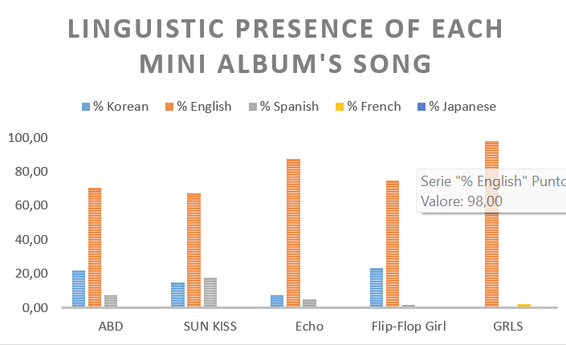
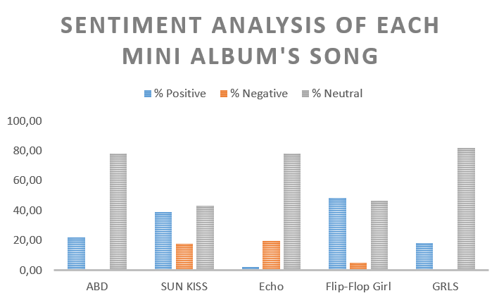

# TUIDE — Linguistic Code-Switching & Sentiment Analysis

## Overview and Motivation

TUIDE's debut has been marketed around the idea of blending different musical languages and visually presented as multilingual, drawing on Korean, English, Japanese, Spanish and French. This project asks a simple question:

> **Do the lyrics of the five tracks on *Tune & Play* actually confirm this multilingual fusion and if so, in what proportion and how does it vary from song to song?**

The project also looks at whether the emotional tone of each track shifts depending on which language is being used within it.

## Data & Methodology

- **Source**: Lyrics for the five tracks (*ABD*, *SUN KISS*, *Echo*, *Flip-Flop Girl*, *GRLS*) were collected from Genius website;
- **Copyright note**: raw lyrics are **not included in this repository** and are excluded via `.gitignore`. Only aggregated, derived statistics (percentages, sentiment scores, charts) are published here. To reproduce the analysis, you'll need to source the lyrics yourself and place them locally as `.txt` files, one per song;
- **Unit of analysis**: each song was split line by line, and every line was analyzed independently for both language and sentiment.

## Tools & Models

| Task | Tool / Model |
|---|---|
| Language detection | [`lingua-py`](https://github.com/pemistahl/lingua-py), restricted to English, Spanish, French, Korean, and Japanese |
| Sentiment analysis | Hugging Face `transformers` pipeline [`cardiffnlp/twitter-xlm-roberta-base-sentiment`](https://huggingface.co/cardiffnlp/twitter-xlm-roberta-base-sentiment), a multilingual model producing 3-class labels (positive / negative / neutral) |
| Aggregation | Python (`collections.Counter`) for per-song percentages |

## Results

### Linguistic presence per song

| Song | Korean | English | Spanish | French | Japanese |
|---|---|---|---|---|---|
| ABD | 22.0% | 70.7% | 7.3% | 0% | 0% |
| SUN KISS | 14.9% | 67.2% | 17.9% | 0% | 0% |
| Echo | 7.3% | 87.8% | 4.9% | 0% | 0% |
| Flip-Flop Girl | 23.3% | 75.0% | 1.7% | 0% | 0% |
| GRLS | 0% | 98.0% | 0% | 2.0% | 0% |

### Sentiment per song

| Song | Positive | Negative | Neutral |
|---|---|---|---|
| ABD | 22.0% | 0% | 78.0% |
| SUN KISS | 38.8% | 17.9% | 43.3% |
| Echo | 2.4% | 19.5% | 78.0% |
| Flip-Flop Girl | 48.3% | 5.0% | 46.7% |
| GRLS | 18.0% | 0% | 82.0% |

## Interpretation

**On the guiding question — the lyrics tell a different story than the marketing.** English dominates every track, ranging from 67% to as high as 98% of lines (*GRLS*). Korean plays a clearly secondary role, peaking at 23.3% in *Flip-Flop Girl*, and French appears only marginally (2%, exclusively in *GRLS*). **Japanese was not detected in any of the five tracks.** In other words, the "multilingual fusion" the group is promoted on seems to live mainly in the group's visual/promotional concept and possibly in the audio production style, rather than in the lyrics themselves — at least for this debut EP.

**On sentiment**, most lines across the album are classified as neutral (43–82%), which is fairly typical of short pop lyric lines lacking strong emotional context on their own. Two tracks stand out: *Flip-Flop Girl* has the most upbeat profile (48.3% positive, only 5% negative), while *Echo* is the clear outlier with the album's highest negative share (19.5%) and almost no positive lines (2.4%) — suggesting a more melancholic tone that contrasts with the rest of the EP.

## Limitations

- **Spanish and French detections are likely false positives.** : there's no indication TUIDE recorded any lyrics in Spanish; the model's Spanish predictions (up to 17.9% in *SUN KISS*) were most likely short ad-libs or phonetically ambiguous lines misclassified due to the line-by-line, out-of-context approach. This wasn't manually verified line by line and should be treated as a known weakness of the method, not a confirmed finding;
- **Very small sample.** : five songs is not enough to generalize about the artist or genre beyond this specific EP. Since they are a novel group, this analysis could be extended in the future for obtaining a more precise answer;
- **Line-level classification lacks context.** : both language detection and sentiment models were applied to isolated single lines, which is harder than analyzing full passages — short or ambiguous lines are more error-prone.

## Reproducing this analysis

1. Get lyrics for the five tracks (e.g. via the Genius API) and save them locally as `ABD_lyrics.txt`, `SUNKISS_lyrics.txt`, `Echo_lyrics.txt`, `Flip_Flop_Girl_lyrics.txt`, `GRLS_lyrics.txt`: these files are gitignored and must be sourced independently for copyright reasons;
2. Install dependencies: `pip install lingua-language-detector transformers torch`;
3. Run `TUIDE_LD.py`.

## License

Code in this repository is released under the MIT License. Song lyrics are not included and remain the property of their respective rights holders.
